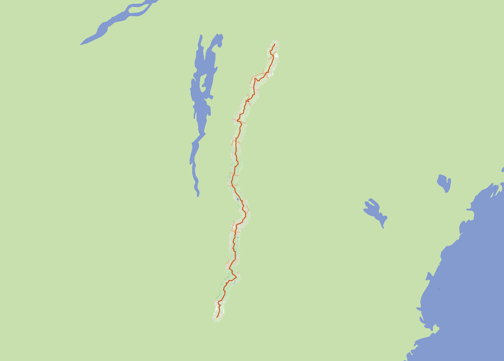

# Create Tiles Around a Buffered Reference Geometry

This tool creates tiles and a weighted graph for use in offline first mobile applications.




## Installation

The project uses a `pyproject.toml` based install. It is recommended to install in "editable" mode so that the `lib` modules are correctly resolved in the Python path and the command is globally accessible.

1.  **Clone the repository:**
    ```bash
    git clone https://github.com/joospis/topo_around_buffer.git
    cd topo_around_buffer
    ```

2.  **Install in editable mode:**
    ```bash
    pip install -e .
    ```

---

## Usage

The installation creates a global command `tiles-from-ref`.

```bash
tiles-from-ref <reference_geometry> <output_dir> [options]
```

This creates the tiles needed for use with [topo_map_style](https://github.com/joospis/topo_map_style)

